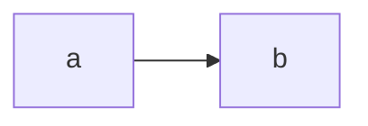

# GD-M5-PROG

## Opdracht 1:
Voor opdracht 1 heb ik een ballenspawner gemaakt....... Functies gebruikt met argumenten en returnn types......

[link naar mijn script](/My_project/Assets/Opdracht1.cs)

## Basic:
bewegen

[link naar mijn script](/My_project/Assets/Ratation.cs)
[link naar mijn script](/My_project/Assets/rondjemaken.cs)
[link naar mijn script](/My_project/Assets/Ratation.cs)
[link naar mijn script](/My_project/Assets/heenweer.cs)

## Basic:
coins pick up
[link naar mijn script](/My_project/Assets/CoinPickup.cs)
[link naar mijn script](/My_project/Assets/ScoreManager.cs)

## normale opdracht 2
ik heb geprobeert om de towers random te kunnen inspawnen maar niet gelukt maar de tower kan wel inspawnen maar niet random
[link naar mijn script](/My_project/Assets/Tower.cs)
[link naar mijn script](/My_project/Assets/TowerSpawner.cs)

## normale opdracht 3
blokken die spawnen en naar heel veel kunnen gaan
[link naar mijn script](/My_project/Assets/enemy.cs)
[link naar mijn script](/My_project/Assets/enemySpawner.cs)

## Les 7 : Early Return Patterns 

[link naar mijn script](/My_project/Assets/07earlyreturns.cs)
 

